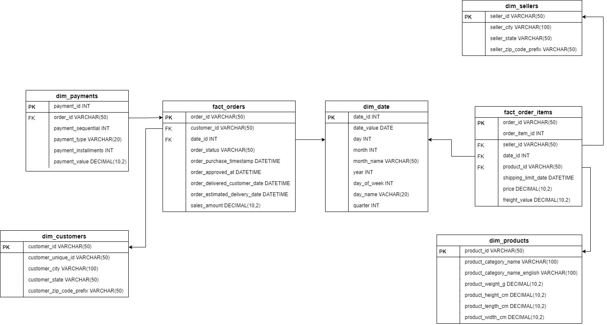

# Diagram Skema Data Warehouse

## 1.2 Diagram Skema Data Warehouse Fact Constellation/Galaxy Schema

Berikut adalah struktur tabel dan relasi yang digunakan dalam skema data warehouse berbasis **Galaxy Schema (Fact Constellation)**.

---

## Pemilihan Model: Galaxy Schema (Fact Constellation)

Kami memilih **Galaxy Schema** karena terdapat dua tabel fakta (`fact_orders` dan `fact_order_items`) yang mewakili proses transaksi dan berbagi dimensi waktu (`dim_date`).

---

## Struktur dan Relasi Antar Tabel

### a) Tabel Fakta (`fact_orders` & `fact_order_items`)

| Tabel            | Fungsi                        | Primary Key (PK)        | Foreign Key (FK)               | Nama Kolom                                                                                                                                                                                                                                                              |
| ---------------- | ----------------------------- | ----------------------- | ------------------------------ | ----------------------------------------------------------------------------------------------------------------------------------------------------------------------------------------------------------------------------------------------------------------------- |
| fact_orders      | Menyimpan ringkasan pesanan   | order_id                | customer_id, date_id           | order_id VARCHAR(50), customer_id VARCHAR(50), date_id INT NOT NULL,order_status VARCHAR(50), order_purchase_timestamp DATETIME, order_approved_at DATETIME, order_delivered_customer_date DATETIME, order_estimated_delivery_date DATETIME, sales_amount DECIMAL(10,2) |
| fact_order_items | Menyimpan detail item pesanan | order_id, order_item_id | seller_id, product_id, date_id | order_id VARCHAR(50),order_item_id INT, seller_id VARCHAR(50), product_id VARCHAR(50),date_id INT, shipping_limit_date DATETIME, price DECIMAL(10,2), freight_value DECIMAL(10,2)                                                                                       |

### b) Tabel Dimensi (`dim_customers`, `dim_sellers`, `dim_products`, `dim_date`, `dim_payments`)

| Tabel         | Fungsi                        | Primary Key (PK)   | Nama Kolom                                                                                                                                                                                                                             |
| ------------- | ----------------------------- | ------------------ | -------------------------------------------------------------------------------------------------------------------------------------------------------------------------------------------------------------------------------------- |
| dim_customers | Menyimpan informasi pelanggan | customer_id        | customer_id VARCHAR(50), customer_unique_id VARCHAR(50), customer_city VARCHAR(100), customer_state VARCHAR(50), customer_zip_code_prefix VARCHAR(20)                                                                                  |
| dim_sellers   | Menyimpan informasi penjual   | seller_id          | seller_id VARCHAR(50), seller_zip_code_prefix VARCHAR(20), seller_city VARCHAR(100),seller_state VARCHAR(50)                                                                                                                           |
| dim_products  | Menyimpan informasi produk    | product_id         | product_id VARCHAR(50), product_category_name VARCHAR(100), product_category_name_english VARCHAR(100),product_weight_g DECIMAL(10,2), product_length_cm DECIMAL(10,2),product_height_cm DECIMAL(10,2), product_width_cm DECIMAL(10,2) |
| dim_date      | Menyimpan informasi waktu     | date_id (YYYYMMDD) | date_id INT, date_value DATE, day INT, month INT, month_name VARCHAR(20), year INT, day_of_week INT,day_name VARCHAR(20), quarter INT                                                                                                  |
| dim_payments  | Menyimpan detail pembayaran   | payment_id         | payment_id INT, order_id VARCHAR(50), payment_sequential INT, payment_type VARCHAR(50), payment_installments INT, payment_value DECIMAL(10,2)                                                                                          |

---

## Diagram Skema

---

## Link Download PDF

Anda dapat mengunduh file PDF lengkapnya di [sini](https://diska.ugm.ac.id/s/7Rpxb4ZWzzFEQ54).
