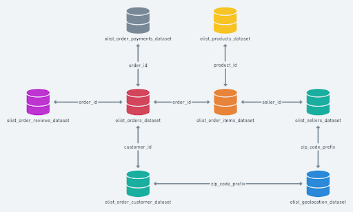

# 📦 Brazilian E-Commerce Public Dataset by Olist

## 👥 Anggota Kelompok
- **Aziz Hendra Atmaja** — 24/546050/PPA/06833  
- **Aziz Solihin** — 24/547433/PPA/06888  
- **Furqan** — 24/546979/PPA/06867  

---

## 📝 Deskripsi Bisnis

**Olist** adalah platform e-commerce asal Brasil yang menghubungkan penjual kecil dan menengah dengan berbagai marketplace besar. Model bisnis Olist memungkinkan para merchant untuk menjual produk mereka tanpa perlu mendaftar langsung ke setiap marketplace, sehingga mempermudah proses penjualan dan logistik.

Semua transaksi dikelola melalui sistem terpusat, mencakup informasi seperti detail pesanan, metode pembayaran, biaya pengiriman, dan ulasan pelanggan. Dengan pendekatan ini, Olist membantu pedagang memperluas jangkauan pasar mereka sekaligus meningkatkan efisiensi pengalaman belanja bagi pelanggan.

Sebagai perusahaan berbasis data, Olist mengandalkan analisis untuk:
- Mengidentifikasi tren penjualan
- Menganalisis perilaku pelanggan
- Mengevaluasi efektivitas metode pembayaran
- Meningkatkan efisiensi pengiriman
- Meningkatkan kepuasan pelanggan

Dengan strategi berbasis data ini, Olist berupaya terus mengembangkan pengalaman berbelanja online yang lebih baik dan menjangkau pasar yang lebih luas.

---

## 📂 Dataset

### 🔖 Nama Dataset
**Brazilian E-Commerce Public Dataset by Olist**

### 🌐 Sumber Dataset
Dataset ini disediakan oleh Olist dan tersedia secara publik di [Kaggle](https://www.kaggle.com/datasets/olistbr/brazilian-ecommerce).

### 🧩 Struktur dan Format Data

Dataset terdiri dari **9 file CSV** yang saling terhubung dan merepresentasikan ekosistem lengkap dari proses e-commerce.

| Nama File                             | Deskripsi                                                                 | Kolom |
|--------------------------------------|---------------------------------------------------------------------------|-------|
| `olist_orders_dataset.csv`           | Informasi pesanan (order ID, status, waktu pemesanan, dll.)               | 8     |
| `olist_customers_dataset.csv`        | Data pelanggan (ID, lokasi, dll.)                                         | 5     |
| `olist_order_items_dataset.csv`      | Detail produk dalam setiap pesanan                                        | 7     |
| `olist_products_dataset.csv`         | Informasi produk (kategori, berat, ukuran, dll.)                          | 9     |
| `olist_sellers_dataset.csv`          | Data penjual (ID, lokasi, dll.)                                           | 4     |
| `olist_order_reviews_dataset.csv`    | Ulasan pelanggan terhadap pesanan                                         | 7     |
| `olist_order_payments_dataset.csv`   | Detail pembayaran (jumlah cicilan, metode bayar, nilai pembayaran)        | 5     |
| `product_category_name_translation.csv` | Terjemahan kategori produk dari Portugis ke Inggris                   | 2     |
| `olist_geolocation_dataset.csv`      | Data lokasi berdasarkan koordinat (zipcode, lat/lon)                      | 5     |

### 📊 Jumlah Record

| Nama File                             | Jumlah Record |
|--------------------------------------|----------------|
| `olist_orders_dataset.csv`           | 99.441         |
| `olist_customers_dataset.csv`        | 99.441         |
| `olist_order_items_dataset.csv`      | 112.650        |
| `olist_products_dataset.csv`         | 32.951         |
| `olist_sellers_dataset.csv`          | 3.099          |
| `olist_order_reviews_dataset.csv`    | 100.000        |
| `olist_order_payments_dataset.csv`   | 103.886        |
| `product_category_name_translation.csv` | 71          |
| `olist_geolocation_dataset.csv`      | 1.000.016      |

---

### 🧭 Relasi Antar Data

---
