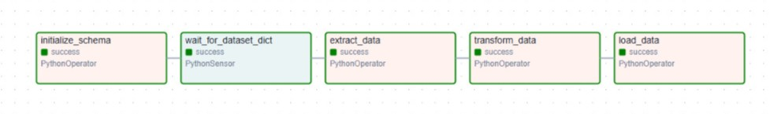
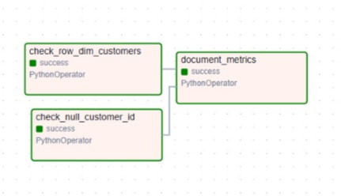

## 1. Repositori Kode

Data Orchestration dengan Apache Airflow : https://github.com/azislhn/dwbi-mmi24/tree/main/data-orchestration

## 2. Dokumentasi

**Diagram DAG ETL**

**Diagram DAG Data Quality**

### Strategi Penjadwalan

Penjadwalan pada DAG ditentukan dengan parameter `schedule_interval='@daily'` yang berarti DAG akan dijalankan satu kali setiap hari. Strategi ini dipilih karena:

- Data transaksi (seperti invoice) umumnya bersifat harian, sehingga pembersihan dan analisis dilakukan setiap akhir hari.
- Frekuensi harian cukup untuk kebutuhan monitoring rutin tanpa membebani resource sistem.
- Dapat dikombinasikan dengan `catchup=False` agar tidak mengeksekusi backlog task saat DAG pertama kali diaktifkan, yang dapat menyebabkan overload.

### Strategi Partisi

Walaupun dalam implementasi ini belum menggunakan partisi eksplisit pada penyimpanan, strategi partisi logis digunakan berdasarkan tanggal (misalnya `invoice_date`). Partisi waktu membantu untuk:

- Menyederhanakan pemrosesan data berdasarkan rentang waktu tertentu (harian/bulanan).
- Mengoptimalkan query dan agregasi data.
- Memudahkan pelacakan anomali data berdasarkan waktu.

Jika ke depan disimpan di data warehouse atau lake seperti BigQuery, Hive, atau Delta Lake, partisi fisik akan diimplementasikan untuk efisiensi.

### Alasan Pemilihan Fitur Airflow

#### Error Handling dan Retry Mechanisms

- **Kenapa dipilih?**
  Agar pipeline lebih andal dan toleran terhadap kegagalan sementara (misalnya, koneksi ke database putus sesaat).

- **Implementasi:**
  - Menggunakan parameter `retries` dan `retry_delay` untuk otomatis mencoba ulang jika gagal.
  - Setiap task dibungkus dengan `try/except` agar error bisa ditangkap dan dijelaskan dengan jelas.

- **Manfaat:**
  - Mengurangi kegagalan DAG secara total akibat masalah minor.
  - Membantu debugging dengan pesan error yang informatif.

#### Email Notifications for Success/Failure

- **Kenapa dipilih?**
  Untuk memberikan visibilitas kepada tim data engineering ketika pipeline selesai sukses atau gagal.

- **Implementasi:**
  - Fitur `email_on_failure` dan `email_on_retry` diaktifkan pada `default_args`.
  - Task `EmailOperator` ditambahkan untuk mengirim notifikasi saat DAG berhasil dieksekusi.

- **Manfaat:**
  - Respons cepat terhadap kegagalan pipeline.
  - Menyediakan log harian bahwa data pipeline berjalan sebagaimana mestinya.

---
