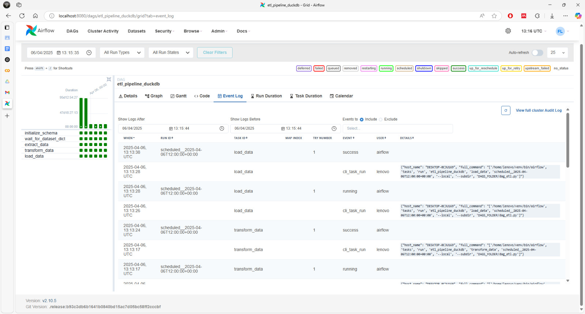
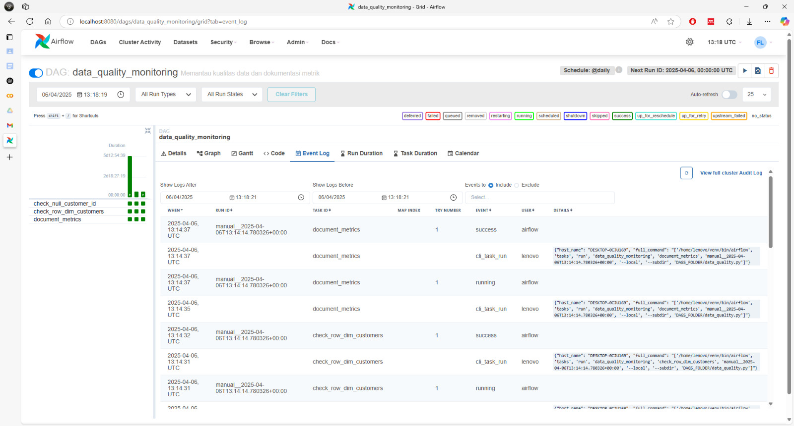

## 📁 1. Repositori Kode

Implementasi Data Orchestration menggunakan Apache Airflow tersedia di repositori berikut:  
🔗 [https://github.com/azislhn/dwbi-mmi24/tree/main/data-orchestration](https://github.com/azislhn/dwbi-mmi24/tree/main/data-orchestration)

---

## 📚 2. Dokumentasi

### 🗺️ Diagram DAG

#### ETL Pipeline

#### Data Quality Check

---

### ⏱️ Strategi Penjadwalan

Penjadwalan DAG dilakukan menggunakan parameter `schedule_interval='@daily'`, yang berarti pipeline akan dieksekusi satu kali setiap hari. Alasan pemilihan strategi ini:

- Data transaksi (seperti invoice) bersifat harian, sehingga pembersihan dan analisis cukup dilakukan setiap akhir hari.
- Frekuensi harian cukup untuk kebutuhan monitoring tanpa membebani resource sistem.
- Digunakan bersama `catchup=False` untuk menghindari eksekusi backlog saat DAG pertama kali diaktifkan.

---

### 📅 Strategi Partisi

Meskipun belum menerapkan partisi fisik pada penyimpanan, pipeline telah menggunakan strategi partisi logis berbasis tanggal, seperti `invoice_date`. Strategi ini bermanfaat untuk:

- Memudahkan pemrosesan data dalam rentang waktu tertentu (harian/bulanan).
- Mengoptimalkan performa query dan agregasi data.
- Mempermudah pelacakan anomali berdasarkan waktu.

Jika ke depannya data disimpan di data warehouse atau data lake (misalnya BigQuery, Hive, atau Delta Lake), maka partisi fisik akan diterapkan untuk efisiensi lebih lanjut.

---

### ⚙️ Alasan Pemilihan Fitur Airflow

#### ✅ Error Handling & Retry Mechanism

**Mengapa dipilih?**  
Agar pipeline lebih andal dan tahan terhadap gangguan sementara (misalnya, koneksi database terputus sesaat).

**Implementasi:**  
- Penggunaan parameter `retries` dan `retry_delay` untuk otomatisasi percobaan ulang.
- Task dibungkus dengan blok `try/except` untuk menangkap dan menjelaskan error.

**Manfaat:**  
- Mengurangi kemungkinan kegagalan total pipeline karena error minor.
- Memberikan log error yang informatif untuk proses debugging.

---

#### 📧 Email Notifikasi (Sukses/Gagal)

**Mengapa dipilih?**  
Untuk memberikan visibilitas kepada tim data engineering terkait status eksekusi pipeline.

**Implementasi:**  
- Aktivasi fitur `email_on_failure` dan `email_on_retry` di `default_args`.
- Penambahan task `EmailOperator` untuk notifikasi saat DAG berhasil dijalankan.

**Manfaat:**  
- Memungkinkan respons cepat terhadap kegagalan pipeline.
- Menyediakan log rutin bahwa pipeline berjalan sebagaimana mestinya.

---

## 📸 3. Bukti Eksekusi DAG

#### ETL DAG - Eksekusi Berhasil

#### Data Quality DAG - Eksekusi Berhasil

---
